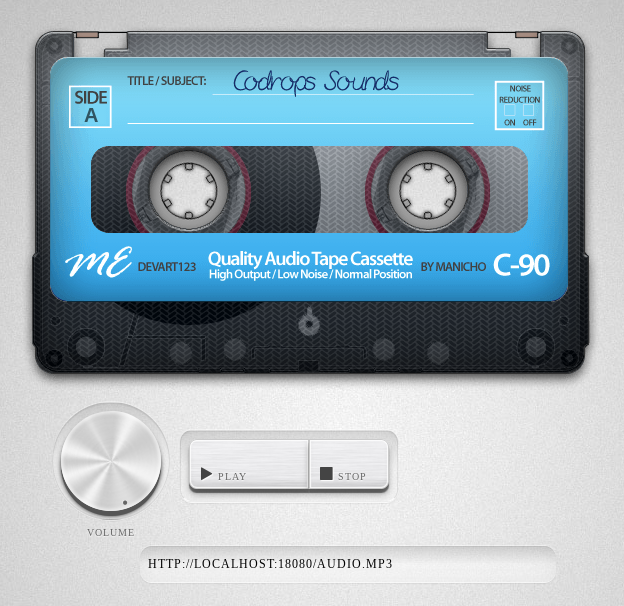

# Casette Player - HTML5 audio stream player

This is a companion app: I was always looking for a good multiplatform (Linux/ChromeOS/Android in my case) stream player that can play my [MPD](https://www.musicpd.org/) audio stream managed through [Audioloader](https://github.com/krisek/audioloader).

I recently stumbled across [this](https://tympanus.net/codrops/2012/07/12/old-school-cassette-player-with-html5-audio/) project and after a bit of tweaking this little HTML5 based music player seems to be perfectly capable to do the job.

The result of this tweaking can be found in this repo.

You might think how weird it is to display a casette during listening to an audio stream, there should be rather a radio displayed. As a matter of fact, this is not really a valid concern in my case: Audioloader is designed to play albums, which were kept on casettes in my case. (I still have around a hundred of them in the basement.) 

The various parts of the code are released under various licences, I kept those. All my modifications (ie. changes after the initial seed) are released under GPLv3.

The whole app speaks for itself, there is no need to further explanation, happy listening!

## TODOs/Known issues:

1. if the player is hosted over https, then only https streams can be played
2. implement PWA
3. implement ChomeApp
4. somehow once the stream exited there is no way to restart, you need to reload the page